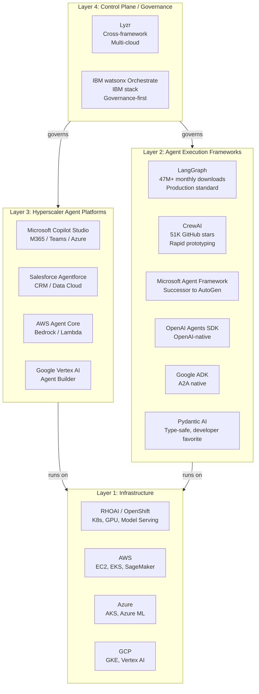

# The Four-Layer Competitive Map

## Overview

The agentic AI ecosystem is not a flat competitive landscape. It's organized into four distinct layers, each serving a different purpose. Companies compete within layers, not across them. Lyzr's strategic insight is operating at the **Control Plane layer** -- above both frameworks and hyperscaler platforms.

---

## The Four Layers

---

## Layer Details

### Layer 1: Infrastructure (Where We Play)

Provides compute, networking, storage, GPU scheduling, Kubernetes orchestration, and model serving.

| Player | Strengths | Weaknesses |
|--------|-----------|-----------|
| **RHOAI / OpenShift** | Hybrid cloud, GPU scheduling, model serving, Kueue, open source | No agent governance, no app layer for agents |
| AWS (EKS, SageMaker) | Scale, breadth of services | Single cloud, vendor lock-in |
| Azure (AKS, Azure ML) | Microsoft integration, enterprise trust | Single cloud, vendor lock-in |
| GCP (GKE, Vertex AI) | AI/ML innovation, TPU access | Smaller enterprise footprint |

### Layer 2: Agent Execution Frameworks (Open Source)

The SDKs and libraries developers use to build individual agents and multi-agent systems.

| Framework | Stars | Status (2026) | Best For |
|-----------|-------|---------------|----------|
| **LangGraph** | 32K | Active (47M+ PyPI downloads/mo) | Stateful agents, durable execution, production |
| **CrewAI** | 51K | Active (v1.14.4) | Role-based multi-agent, rapid prototyping |
| **Microsoft Agent Framework** | 10K | Active (AutoGen successor) | Microsoft/Azure-native enterprises |
| **OpenAI Agents SDK** | -- | Active | OpenAI-first teams |
| **Google ADK** | -- | Active (v1.0, A2A native) | Google Cloud / A2A native |
| **Pydantic AI** | -- | Active | Type-safe, Python-first DX |
| **AutoGen** | 58K | **Maintenance mode** | Legacy only (use MAF for new projects) |

### Layer 3: Hyperscaler Agent Platforms (Managed Services)

Managed, ecosystem-specific platforms for building and deploying agents.

| Platform | Ecosystem Lock | Pricing | Strengths | Weaknesses |
|----------|---------------|---------|-----------|-----------|
| **Microsoft Copilot Studio** | M365/Teams/Azure | $30/user/mo + credits | Deepest enterprise integration | Microsoft-only, no cross-framework |
| **Salesforce Agentforce** | Salesforce CRM | ~$2/conversation | Native CRM data access | Salesforce-only, limited multi-cloud |
| **AWS Agent Core** | AWS | Usage-based | Bedrock integration, AWS security | AWS-only, limited governance UI |
| **Google Vertex AI Agent Builder** | GCP | Usage-based | AI innovation, A2A native | Smaller enterprise footprint |

### Layer 4: Control Plane / Governance (Where Lyzr Plays)

The governance layer that sits above everything else -- managing agents regardless of which framework built them or which cloud runs them.

| Platform | Focus | Framework Support | Cloud Support | Pricing |
|----------|-------|-------------------|---------------|---------|
| **Lyzr** | Cross-framework governance | LangChain, CrewAI, Agentforce, Copilot, custom | AWS, Azure, GCP, on-prem, air-gapped | $0.03-$0.30/run |
| **IBM watsonx Orchestrate** | Enterprise workflow automation | IBM-native + emerging cross-framework | IBM Cloud, hybrid | $530/month + usage |

---

## Key Insight

**Lyzr does not compete with frameworks or infrastructure. It sits above both and governs them.**

A customer can use LangGraph (framework) on OpenShift (infrastructure) with Lyzr (control plane). In this scenario, Lyzr owns the customer relationship for agent governance, and the infrastructure provider is commoditized beneath it.

This is the strategic risk: **if we don't build or partner for a control plane, someone else will sit on top of our infrastructure and own the agent management layer.**
