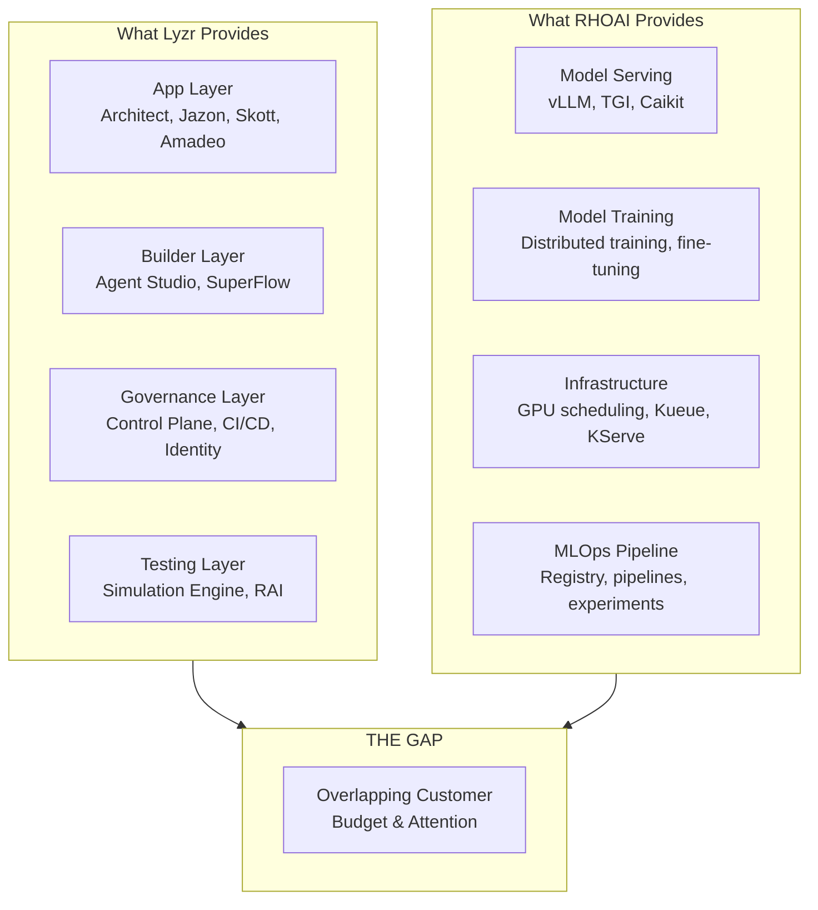
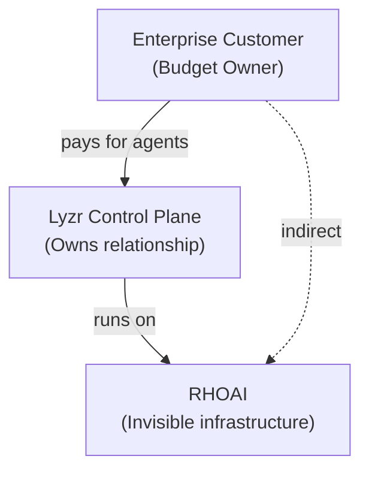

# Lyzr vs RHOAI -- Gap Analysis

!!! danger "Critical Competitive Assessment"
    This page directly addresses the question: "I think they already have a platform more robust than ours... certainly at the app layer but I think below as well."

---

## Different Layers, Overlapping Customers

Lyzr and RHOAI operate at **different layers of the stack** but compete for the **same enterprise budget and customer attention**.

---

## Layer-by-Layer Comparison

### Where Lyzr Is Stronger (App + Governance Layers)

| Capability | Lyzr | RHOAI | Gap |
|-----------|------|-------|-----|
| **Agent Builder (No-Code)** | Agent Studio -- visual drag-and-drop agent creation | None | **Critical gap** |
| **Agent Builder (Text-to-App)** | Architect -- plain English → deployed app | None | **Critical gap** |
| **Pre-Built Vertical Agents** | 200+ (banking, sales, marketing, HR) | None | **Critical gap** |
| **Multi-Agent Orchestration** | Manager Agent + SuperFlow (5 patterns) | None native | **Critical gap** |
| **Agent CI/CD** | Git-triggered, version-tagged, staged promotion | None for agents | **Significant gap** |
| **Agent Identity** | Per-agent Okta identity, auto-revocation | None | **Significant gap** |
| **Agent Registry** | Central catalog of all agents across frameworks | None | **Significant gap** |
| **Agent Simulation** | Persona x scenario testing, automated hardening | None | **Significant gap** |
| **Responsible AI for Agents** | PII, toxicity, hallucination, injection -- infrastructure-level | TrustyAI (model bias focus) | **Moderate gap** |
| **Agent Observability** | Per-run traces, latency, tokens, cost | Prometheus/Grafana (infrastructure metrics) | **Moderate gap** |
| **Consumption Pricing** | $0.03-$0.30/run | Subscription-based | **Business model gap** |
| **Voice Agents** | Native telephony (Twilio, Telnyx, Plivo) | None | **Gap** |
| **Knowledge Management** | Classic RAG, Knowledge Graph (Neo4j), Semantic Model (Text-to-SQL), Cognis memory | None native | **Significant gap** |
| **Cross-Framework Governance** | LangChain, CrewAI, Agentforce, custom -- one control plane | None | **Critical gap** |

### Where RHOAI Is Stronger (Infrastructure + MLOps Layers)

| Capability | RHOAI | Lyzr | Gap |
|-----------|-------|------|-----|
| **GPU Scheduling** | Kueue, NVIDIA GPU Operator, multi-GPU support | None -- runs on top of cloud providers | **Lyzr cannot do this** |
| **Model Serving** | vLLM, TGI, Caikit-TGIS, KServe, ModelMesh | Uses hosted LLM APIs (OpenAI, Anthropic, Bedrock) | **Lyzr cannot do this** |
| **Model Training** | Distributed training, fine-tuning, InstructLab | ShadowLM (emerging, not GA) | **Lyzr cannot do this** |
| **Model Registry** | Model versioning, lineage tracking | None | **Lyzr cannot do this** |
| **ML Pipelines** | Kubeflow/Elyra pipelines, experiment tracking | None | **Lyzr cannot do this** |
| **Kubernetes Orchestration** | Full OpenShift platform | None -- deploys as containers on customer's K8s | **Lyzr cannot do this** |
| **Hardware Optimization** | Multi-GPU, model parallelism, memory optimization | Hardware-unaware | **Lyzr cannot do this** |
| **Hybrid Cloud** | Identical experience on-prem, cloud, edge | Supports on-prem but cloud-first | **RHOAI stronger** |
| **Open Source DNA** | Genuine open-source (upstream Kubernetes, KServe, etc.) | Open-core (Apache 2.0 framework, proprietary enterprise) | **RHOAI stronger** |

---

## The Critical Assessment

### "Certainly at the app layer..."

**Verdict: Correct.** Lyzr is categorically ahead at the application layer. They have:

- A no-code agent builder (Studio)
- A text-to-app generator (Architect)
- 200+ pre-built agents with measurable ROI
- Five orchestration patterns (sequential, parallel, hierarchical, handoff, loop)
- Voice agent capabilities
- A simulation engine for pre-production testing

RHOAI has **none of these**. This is not a small gap -- it's a missing layer entirely.

### "...but I think below as well"

**Verdict: Partially correct, with important nuance.**

At the **governance/platform layer** (Control Plane, CI/CD, identity, registry), Lyzr is ahead. RHOAI does not have agent-specific governance tooling.

At the **infrastructure layer** (GPU scheduling, model serving, model training, Kubernetes), RHOAI is categorically ahead. Lyzr has **zero infrastructure capabilities**. They depend entirely on cloud providers for compute.

The nuance: **Lyzr's layer sits above RHOAI's layer.** They are not directly competitive -- they are potentially complementary. But if Lyzr captures the customer relationship at the agent management layer, RHOAI becomes invisible infrastructure beneath it.

---

## The Strategic Risk

**Scenario:** A bank deploys Amadeo (Lyzr's banking suite) on OpenShift. The bank's CTO interacts with Lyzr for agent management, simulation, and governance. OpenShift runs the containers. The bank pays Lyzr for agent runs and Red Hat for infrastructure.

**The risk:** Lyzr owns the customer conversation about AI agents. Red Hat is commoditized infrastructure. When the bank's CEO asks "what's our AI strategy?", the answer is "Lyzr" -- not "Red Hat."

**The opportunity:** If Red Hat builds or acquires agent governance capabilities, the value proposition becomes "the only platform that handles model training, model serving, GPU optimization, AND agent governance -- all on your infrastructure, all open source."

---

## Recommended Response Priorities

### Tier 1: Must-Have (6 months)

1. **Agent governance framework** -- Identity, RBAC, audit trails for agents. Even a basic agent registry + observability would close the most critical gap.
2. **Agent CI/CD integration** -- Extend OpenShift GitOps to include agent deployment pipelines with evaluation gates.
3. **Partnership evaluation** -- Assess Lyzr, IBM watsonx, or others as potential partners for the governance layer. If we can't build it, partner before a competitor does.

### Tier 2: Should-Have (12 months)

4. **Agent simulation/evaluation service** -- Cloud-native, framework-agnostic eval service. Could be built on existing MLOps pipeline infrastructure.
5. **Pre-built reference architectures** -- "Deploy a KYC agent on OpenShift in 30 days." Vertical-specific, opinionated, production-ready.
6. **Consumption-based metering** -- Track and bill per agent run, not per seat.

### Tier 3: Differentiators (18 months)

7. **Full-stack agent platform** -- No-code builder + orchestration + governance + infrastructure. The "one platform" story.
8. **Open-source agent governance** -- If we open-source an agent control plane, we do to Lyzr what Kubernetes did to proprietary orchestrators.
9. **ShadowLM equivalent** -- Leverage training infrastructure to offer "model ownership" -- train customer-specific models from agent interaction data.
