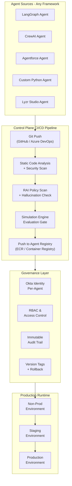

# Control Plane

!!! tip "The Crown Jewel"
    The Control Plane is Lyzr's most strategically important product. It's what transforms them from "another agent builder" into "the Kubernetes for AI agents." This is the capability most directly threatening to infrastructure providers.

## What It Is

The Lyzr Agent Control Plane is a centralized governance layer that sits **above** agent execution frameworks. It accepts agents built on **any framework** -- LangChain, CrewAI, Agentforce, Copilot Studio, custom Python -- and provides unified:

- **Registry & Discovery** -- Single catalog of every agent across the enterprise
- **Identity** -- Per-agent Okta identity (scoped, attributed, auto-revoked)
- **CI/CD** -- Git-triggered deployment pipeline with version tagging and rollback
- **Evaluation Gates** -- Mandatory simulation + RAI checks before production
- **Observability** -- Traces, latency, token usage, cost tracking per agent
- **Governance** -- RBAC, audit trails, compliance artifacts

Lyzr positions this as "the Vercel for AI agents" -- the same way Vercel simplified web app deployment, Lyzr simplifies agent deployment.

---

## Architecture

---

## Key Capabilities in Detail

### 1. Agent Registry

The registry is the **state store** of the Control Plane -- equivalent to etcd in Kubernetes. It is the authoritative record of every agent that exists across the enterprise.

Each entry tracks:

| Field | Description |
|-------|-------------|
| Framework | LangGraph, CrewAI, Lyzr SDK, custom |
| Target runtime | AWS Bedrock, Azure, GCP, on-prem |
| Deployment status | Non-prod, staging, production, decommissioned |
| Approval history | Who approved each deployment and when |
| Evaluation results | Pass/fail record for every simulation run |
| Identity | Okta identity mapping |

### 2. Per-Agent Okta Identity

!!! warning "This Is a Big Deal"
    Most enterprise AI deployments share credentials between agents and human service accounts. This is a standing security liability. Lyzr assigns each agent its own dedicated Okta identity.

- Each agent gets its own Okta identity in the appropriate environment (non-prod or production)
- Identity is tied to the agent's registry entry -- unified view of what it is, what it can do, how it authenticates
- Fine-grained access control and audit trails per agent action
- When an agent is decommissioned or fails evaluation, identity is **automatically revoked**

### 3. Agent CI/CD Pipeline

Enterprise software has had CI/CD for decades. Agent deployments have not -- until now.

**How it works:**

1. Developer pushes code to GitHub or Azure DevOps
2. Webhooks fire automatically
3. Pipeline runs: static analysis → security scan → RAI policy check → simulation evaluation
4. If all gates pass: push to container registry, register in Agent Registry, assign Okta identity
5. Staged promotion: dev → UAT → pre-prod → production
6. Every stage creates a version tag
7. **Rollback is one command** back to a known-good state

### 4. Cross-Framework Governance

This is the critical differentiator:

| Stakeholder | Without Control Plane | With Lyzr Control Plane |
|-------------|----------------------|------------------------|
| **Developers** | Manual, ad-hoc deployment. Each team does it differently. | One governed pipeline. Every agent. Every time. |
| **Security teams** | No visibility. Shared credentials. No revocation path. | Per-agent Okta identity. Automatic revocation. |
| **Compliance** | No audit trail. No evaluation records. | Immutable logs. Every action traceable. |
| **Operations** | No rollback. No version history. | Automatic rollback to known-good state. |

### 5. EU AI Act Compliance

The EU AI Act requires demonstrable governance for high-risk AI systems -- evidence, not policy documents. The Control Plane produces this evidence automatically:

- Immutable deployment logs
- Evaluation results
- Approval chains
- Step-level traces
- Audit-ready from the first deployment

---

## Competitive Implications

The Control Plane is where Lyzr transitions from "a tool you use" to "infrastructure you depend on." Key implications:

1. **It creates stickiness.** Once an enterprise registers 50+ agents in Lyzr's registry with Okta identities, switching costs are high.
2. **It sits above the infrastructure layer.** Whoever provides the cloud (AWS, Azure, OpenShift) is below the Control Plane. Lyzr owns the customer relationship.
3. **It's framework-agnostic by design.** A customer running LangGraph on RHOAI could add Lyzr's Control Plane without changing their infrastructure.
4. **The "Kubernetes for agents" analogy is apt.** Kubernetes won by being the neutral orchestration layer. Lyzr is attempting the same play for agents.
