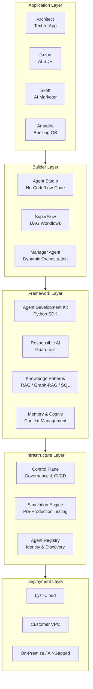

# Lyzr.ai Deep-Dive

## Overview

Lyzr.ai is a full-stack enterprise agent infrastructure platform that enables organizations to build, deploy, and govern autonomous AI agents. Founded in 2023, headquartered in Jersey City, NJ, with operations in 7 countries and 150-200 employees.

Their core thesis: **context engineering is the real driver of agent performance, not LLM selection.** The platform is model-agnostic, framework-agnostic, and cloud-agnostic.

---

## Product Suite at a Glance

---

## Sections

| Section | What You'll Learn |
|---------|------------------|
| [Company Profile](company-profile.md) | Founding story, leadership, funding, investors, growth trajectory |
| [Product Architecture](product-architecture.md) | Five-layer stack, how components compose, lifecycle |
| [Control Plane](control-plane.md) | The crown jewel -- governance, CI/CD, identity, registry |
| [Agent Studio & Architect](studio-architect.md) | No-code builder and text-to-app generator |
| [Simulation Engine](simulation-engine.md) | Pre-production testing and automated hardening |
| [Responsible AI](responsible-ai.md) | PII, hallucination, toxicity, bias controls |
| [Pre-Built Agents](prebuilt-agents.md) | Amadeo (banking), Jazon (sales), Skott (marketing) |
| [OGI Vision](ogi-vision.md) | Organizational General Intelligence -- the long-term play |
