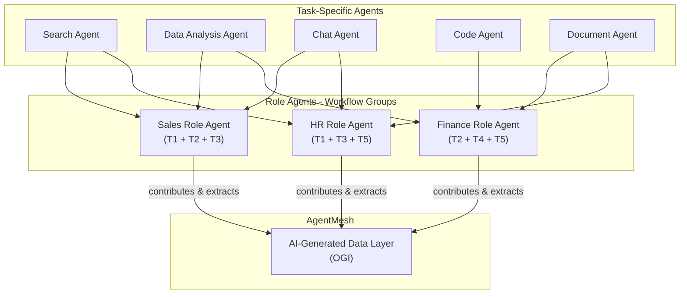

# OGI -- Organizational General Intelligence

## The Long-Term Vision

Lyzr's ultimate ambition extends beyond individual agents to **Organizational General Intelligence (OGI)**: a unified, self-improving "collective brain" for enterprises.

> *"The era of siloed AI copilots is over. The future belongs to an interconnected AI workforce that forms an organization's central intelligence."*
> -- Siva Surendira, CEO

---

## What OGI Is

OGI is **not** Artificial General Intelligence (AGI). It's about **emergent intelligence within an enterprise** -- when specialized agents across departments share context and decisions through a central knowledge layer.

Think of OGI as the "brain" of your organization, with each AI agent serving as a specialized neuron. Together, they create a system far more powerful than any single agent.

---

## Architecture: Task Agents → Role Agents → AgentMesh → OGI

### How It Builds:

1. **Task-specific agents** handle individual capabilities (search, analysis, chat)
2. **Role agents** group task agents into workflow-level automation (HR agent = search + chat + document)
3. **AgentMesh** connects role agents through a shared, AI-generated data layer
4. **OGI** emerges as the data layer grows -- every decision, output, and correction makes the system smarter

---

## ShadowLM -- The Model Ownership Layer

ShadowLM is Lyzr's approach to long-term model ownership:

- Captures intelligence generated during enterprise workflows (approved outputs, human reviews, corrections, feedback loops)
- Progressively transfers specialized workloads from frontier models to **enterprise-owned open-weight models**
- Goal: reduce dependency on external LLM providers without sacrificing performance

### Why This Matters

Instead of renting intelligence indefinitely, enterprises can convert operational knowledge into a **strategic asset** that becomes cheaper, more private, and more valuable with every decision it learns from.

---

## Strategic Implications

OGI represents Lyzr's play for **maximum lock-in through maximum value**:

1. **Network effects:** More agents = richer OGI data layer = better performance for every agent = more agents deployed
2. **Data moat:** The AI-generated data layer contains institutional intelligence that cannot be recreated by switching platforms
3. **Model ownership:** ShadowLM means the customer's OGI progressively becomes an owned asset, but one that lives on Lyzr's platform
4. **Cross-department value:** OGI solves the "$3.1 trillion data silo problem" by connecting intelligence across functions

This is the most ambitious and potentially the most defensible part of Lyzr's strategy. If they execute, switching away from Lyzr means losing your organization's accumulated intelligence.
