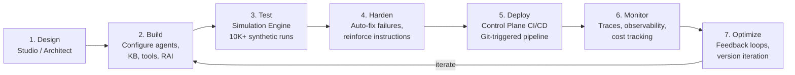

# Product Architecture

## Five-Layer Stack

Lyzr's platform is organized into five layers. The top three are where agents are built and run. They sit on two foundation layers that every agent depends on.

### Layer 1: Agent Framework (Runtime Engine)

The core compute layer that powers every agent:

- **LLM calls** -- Model-agnostic: OpenAI (GPT-4o, GPT-5, o3, o4-mini), Anthropic (Claude Sonnet 4/4.5, Opus 4/4.5), Google (Gemini 2.x, 3.0), Amazon Bedrock, Groq, Perplexity
- **Tool execution** and function calling
- **Memory management** -- Short-term, long-term, and Cognis (organizational memory)
- **Responsible AI enforcement** -- Embedded into the inference loop, not bolted on
- **Protocol adapters** -- MCP, OpenAI functions, Google A2A, REST, gRPC

### Layer 2: Agent Studio (Builder Layer)

The visual, no-code/low-code environment:

- Creating and configuring agents (role, goal, instructions, model, tools, memory, knowledge base)
- Multi-agent orchestration (Manager Agent for dynamic, SuperFlow for DAG-based)
- Knowledge base management (Classic RAG, Knowledge Graph via Neo4j, Semantic Model via Text-to-SQL)
- Voice agents with telephony (Twilio, Telnyx, Plivo)
- Evaluation, versioning, and deployment
- Team governance (roles, audit log)

### Layer 3: Architect (Application Layer)

Text-to-app platform that generates full-stack agentic applications:

- Input a business goal in natural language
- Architect generates: frontend (React/Next.js), multi-agent backend, auth, database
- Self-correction via built-in QA Agent
- Deploys to a live URL

### Layer 4: Foundation -- Knowledge & Context

Organizational knowledge resources decoupled from individual agents:

- **Classic Knowledge Base** -- RAG with vector database
- **Knowledge Graph** -- Neo4j-powered relationship reasoning
- **Semantic Model** -- Text-to-SQL for structured data
- **Cognis** -- Memory-as-a-service with MCP support
- **Global Contexts** -- Org-wide instructions shared across all agents

### Layer 5: Foundation -- Safety & Governance

Mandatory safety layer embedded at the framework level:

- Responsible AI modules (PII, toxicity, hallucination, injection)
- Agent Simulation Engine for pre-production testing
- Control Plane for cross-framework governance

---

## Build-to-Production Lifecycle

### What happens at each stage:

| Stage | Tool | Details |
|-------|------|---------|
| **Design** | Agent Studio or Architect | Define agent roles, goals, orchestration patterns |
| **Build** | Studio UI or ADK (Python SDK) | Configure LLM, tools, knowledge bases, memory, RAI policies |
| **Test** | Simulation Engine | Cross-product of personas x scenarios generates synthetic conversations |
| **Harden** | Automated Hardening | Analyzes failure patterns, rewrites agent instructions, re-tests |
| **Deploy** | Control Plane CI/CD | Git push triggers pipeline: static analysis → security scan → registry → Okta identity → staged promotion |
| **Monitor** | Traces & Observability | Per-run traces, latency, token usage, cost, hallucination rate |
| **Optimize** | Feedback + ShadowLM | Continuous improvement; ShadowLM transfers learning to enterprise-owned models |

---

## Product Entry Points

| I want to... | Product | Why |
|-------------|---------|-----|
| Build agents visually, no code | **Agent Studio** | Visual builder with instant API endpoint |
| Orchestrate complex workflows | **Studio + SuperFlow** | DAG-based visual builder with durable execution |
| Build a full-stack AI app from English | **Architect** | Generates frontend + agentic backend |
| Build agents programmatically | **ADK** (Python SDK) | Full SDK control, integrates into existing codebases |
| Add RAG/memory/guardrails to existing product | **Lyzr Blocks** | Standalone modules with independent API endpoints |
| Govern agents from any framework | **Control Plane** | CI/CD, identity, audit for LangChain/CrewAI/custom agents |

---

## Key Architectural Principles

1. **Safety is not optional.** The Responsible AI module is embedded at the framework level. Every request passes through a safety pipeline before reaching the agent.

2. **Knowledge is shared.** Knowledge bases, semantic models, and Cognis memory are organizational resources -- any agent can connect to them. Not siloed per-agent.

3. **Framework, ADK, and API are distinct but unified.** The Agent Framework is the runtime. The ADK and REST API are programmatic interfaces. Agent Studio is a visual interface. All operate on the same underlying engine.

4. **Composability across products.** Build agents in Studio → import into Architect apps. Create via ADK → manage in Studio. Lyzr Blocks (KB, Cognis, RAI) callable from LangChain or any external framework.
