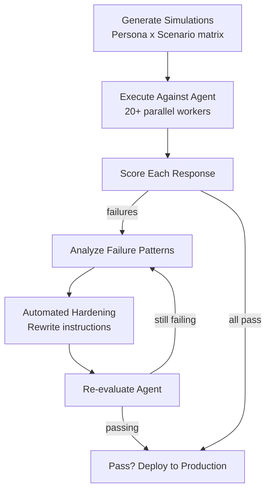

# Agent Simulation Engine

## Overview

The Agent Simulation Engine (A-Sim) is Lyzr's proprietary pre-production testing framework. It generates synthetic conversations from persona and scenario combinations, evaluates agent responses, and automatically rewrites agent instructions based on failures.

!!! note "Why This Matters"
    89% of AI agent projects never reach production. The primary blockers are reliability, hallucination, and lack of testing. The Simulation Engine directly addresses all three. This is one of Lyzr's most defensible differentiators.

---

## How It Works

### World Model: Personas x Scenarios

A-Sim structures testing around two dimensions:

**Personas** (user archetypes):

- First-time user unfamiliar with the product
- Experienced power user with technical knowledge
- Adversarial user trying to bypass guardrails
- Enterprise decision-maker
- Non-technical user

**Scenarios** (task types):

- Basic policy inquiry
- Complex compliance issue
- Out-of-scope request the agent should refuse
- Edge case with ambiguous intent
- Multi-step workflow requiring tool usage

A-Sim creates a **cross-product matrix**: every persona x every scenario = a set of synthetic test conversations. This ensures the agent is tested across the full range of situations it will encounter in production.

---

## Evaluation Pipeline

### Evaluation Metrics

| Metric | What It Measures |
|--------|-----------------|
| **Task Completion** | Did the agent accomplish what the user asked? |
| **Hallucination** | Did the agent fabricate facts not in its knowledge? |
| **Faithfulness** | Is the response grounded in the connected Knowledge Base? |
| **Toxicity** | Did the agent produce harmful or inappropriate content? |
| **Tool Accuracy** | Did the agent call the correct tool with correct parameters? |
| **Context Retention** | Does the agent remember earlier parts of multi-turn conversations? |
| **Instruction Adherence** | Does the agent follow its configured instructions? |
| **Reasoning Across Turns** | Do later responses build logically on earlier ones? |
| **Response Relevance** | Does the response stay aligned with the task? |
| **Outcome Completeness** | Does the conversation end with a useful result? |

---

## Automated Hardening

When simulations fail, A-Sim enters a reinforcement loop:

1. **Diagnoses failure patterns** across the evaluation round
2. **Produces two agent configurations:** original + improved version with rewritten instructions targeting specific failures
3. **Human review** option: inspect changes before applying
4. **Automated mode:** applies fixes and re-evaluates automatically
5. **Loop continues** round by round until all simulations pass or max rounds reached

### Hardening Recommendations Include:

- Instruction rewrites targeting specific failure patterns
- Model selection changes (e.g., switch to a model with better reasoning)
- Feature configuration (e.g., enable Reflection for agents that hallucinate)
- Knowledge base adjustments

---

## Production Quality Gate

A reasonable threshold for most production agents:

- **90%+ task completion** rate
- **Zero toxicity failures**
- **Hallucination rate below acceptable limit**
- **All tool calls producing correct outputs**

The Simulation Engine is the primary quality gate before promoting any agent to production.

---

## How This Differs from LangSmith / Braintrust

| Feature | Lyzr Simulation Engine | LangSmith | Braintrust |
|---------|----------------------|-----------|------------|
| Synthetic test generation | Native (persona x scenario) | Manual dataset creation | Manual dataset creation |
| Multi-turn evaluation | Native | Limited | Limited |
| Automated hardening | Native (rewrites instructions) | Not available | Not available |
| Framework support | Any (via Control Plane) | LangChain-native | Framework-agnostic |
| Pre-production gate | Integrated into CI/CD | Separate tool | Separate tool |
| Enterprise governance | SOC 2, audit trails | Developer-focused | Developer-focused |

The key difference: LangSmith and Braintrust are **evaluation tools**. Lyzr's Simulation Engine is an **evaluation + automated repair system** integrated into a governed deployment pipeline.

---

## Migration Feature

For agents originally imported from external frameworks (LangGraph, CrewAI), the Simulation Engine includes a **Migration** step that exports the hardened agent configuration back to the original framework format. This means you can:

1. Import a LangGraph agent into Lyzr
2. Run simulations and hardening
3. Export the improved agent back to LangGraph

This is a smart adoption play -- it reduces commitment anxiety while creating value that makes staying on Lyzr attractive.
