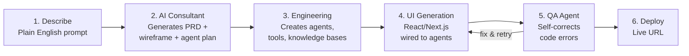

# Agent Studio & Architect

## Agent Studio

Agent Studio is Lyzr's no-code and low-code environment for building, testing, deploying, and monitoring AI agents. It is the primary UI layer on top of the Lyzr Agent Framework.

### What You Can Build

- **Single agents:** Chatbots, Q&A bots, data analysts, voice agents
- **Multi-agent systems:** Manager Agent (dynamic) or SuperFlow (DAG-based)
- **Knowledge bases:** Classic (RAG), Knowledge Graph (Neo4j), Semantic Model (Text-to-SQL)
- **Voice agents:** Phone bots with Realtime or Pipeline engine, Twilio/Telnyx/Plivo telephony

### Core Sections

| Sidebar Item | Function |
|-------------|----------|
| Agents | Create and manage single agents |
| Voice | Build and monitor voice agents |
| Managerial | View and interact with Manager Agent orchestrations |
| SuperFlow | Build visual DAG-based workflows |
| Knowledge Base | Manage Classic KB, Knowledge Graph, Semantic Model |
| Tools | Connect and manage tool integrations |
| Skills | Manage reusable skill packages |
| Responsible AI | Create and manage guardrail policies |
| Global Context | Set org-wide agent instructions |
| Data Connectors | Connect databases and vector stores |
| Traces | Monitor agent runs, latency, and token usage |
| Manage | Team settings, roles, audit log, billing |

### Orchestration Models

Lyzr provides two orchestration models that can be combined:

=== "Manager Agent (Dynamic)"

    A central manager agent receives a user goal and **dynamically decides** which worker agents to call, in what order, and with what inputs. The manager reasons about the best execution path at runtime.

    **How it works:**

    1. User sends a message to the manager agent
    2. Manager determines which worker agents are relevant
    3. Manager delegates subtasks to workers (sequentially or in parallel)
    4. Manager synthesizes worker outputs into a final response

    **Best for:** Complex, goal-driven tasks where the execution path varies by input.

=== "SuperFlow (Deterministic DAG)"

    A visual DAG-based workflow builder. You define the exact execution graph, and the workflow runs **deterministically every time**.

    **Node types available:**

    | Node | Function |
    |------|----------|
    | AI Agent | Runs a Lyzr agent with all its tools, KB, and memory |
    | A2A Agent | Invokes an external agent via Agent-to-Agent protocol |
    | LLM | Inline model call with custom prompt, can orchestrate sub-agents via ReAct |
    | AI Swarm | Runs multiple agents in parallel, merges results |
    | Tool | Calls a configured tool directly without going through an agent |
    | If / Switch | Binary or multi-way branching (rule-based or AI-driven) |
    | Loop | Iterates over a list, once per item or in batches |
    | Wait for Approval | Pauses for human review (HITL) |
    | Code Block | Runs JavaScript transformations |
    | HTTP Request | Connects external systems |

    **Best for:** Repeatable automations requiring exactly-once execution, scheduling, human approvals, or strict ordering.

=== "Hybrid (Combined)"

    Manager Agent + SuperFlow in the same system:

    1. Manager Agent handles the conversational interface with the user
    2. When a deterministic multi-step process is needed, the manager triggers a SuperFlow
    3. SuperFlow executes with retries, approvals, and exactly-once guarantees
    4. SuperFlow returns results to the manager for final response

### Five Orchestration Patterns

1. **Sequential** (chain) -- Agents execute in order, output feeds the next
2. **Parallel** (fan-out / fan-in) -- Multiple agents execute simultaneously, results merge
3. **Hierarchical** (manager and workers) -- Manager delegates to specialist agents
4. **Handoff** (routing) -- Route user to the right team/agent
5. **Loop** (iteration with evaluation) -- Repeat until quality threshold met

---

## Architect

Architect is Lyzr's "text-to-app" platform that transforms natural language into deployed, full-stack agentic applications.

### How It Works

### Key Features

- **AI Consultant:** Before you write anything, Architect helps identify highest-value automation opportunities based on your role. Generates tailored app ideas with estimated time savings.
- **PRD Generation:** Architect acts as Lead Product Manager -- outlines user journey, identifies needed agents, defines UX wireframe.
- **Agent Orchestration:** Connects to Lyzr Studio to spin up agents (researchers, writers, analysts) and wires them into the app backend.
- **Self-Correction Loop:** Built-in QA Agent runs generated code. If it fails type checks or throws errors, it rewrites and re-checks automatically.
- **One-Click Deploy:** Pushes to a live production URL or custom domain.
- **Export:** Full source code export for customization.

### Why This Matters Competitively

Architect dramatically lowers the barrier to building agentic applications. A business user can go from "I want an AI that qualifies leads from our CRM" to a deployed, multi-agent application in minutes. This is a capability that infrastructure-first platforms (including RHOAI) do not offer.
