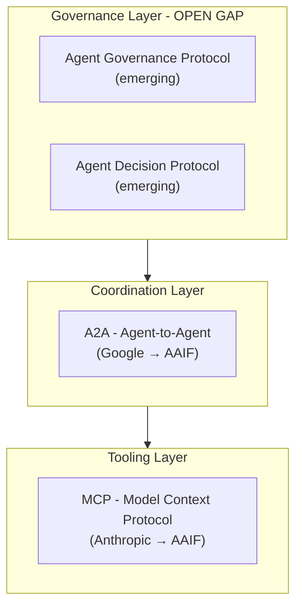

# Emerging Standards & Protocols

## The Protocol Stack (2026)

The agentic AI protocol ecosystem has settled into a three-layer architecture, governed by the **Linux Foundation Agentic AI Foundation (AAIF)** (co-founded by OpenAI, Anthropic, Google, Microsoft, AWS, and Block in December 2025).

---

## Layer 1: MCP (Model Context Protocol)

**Created by:** Anthropic (donated to AAIF, Dec 2025)
**Purpose:** Standardizes how an AI agent connects to external tools, data sources, and services
**Analogy:** The standard interface between an AI brain and its hands

### Key Features:
- Tool discovery endpoints
- Context state management
- External tool access boundaries
- Streaming support
- Configurable security boundaries

### Adoption:
- 100+ enterprises joined as AAIF supporters by Feb 2026
- Microsoft Copilot Studio reached MCP GA in May 2025
- Salesforce Agentforce MCP client entered pilot July 2025

---

## Layer 2: A2A (Agent-to-Agent Protocol)

**Created by:** Google (donated to AAIF, June 2025)
**Purpose:** Standardizes how AI agents discover, communicate, and collaborate with each other
**Analogy:** HTTP for AI agents

### Key Concepts:

- **Agent Cards:** JSON-LD documents describing an agent's capabilities, inputs, outputs, and required authentication
- **Dynamic Discovery:** Planning agents can query a registry to find capable sub-agents without hardcoded knowledge
- **Task Delegation:** Structured task routing and result tracking
- **IBM ACP Merger:** IBM's Agent Communication Protocol merged into A2A in August 2025

### Version History:
- v1.0.1 (May 2026) introduced extension mechanism supporting new data, requirements, RPC methods, and state machines
- Four official extensions: Secure Passport, Timestamp, Traceability, Agent Gateway Protocol

---

## Layer 3: Governance -- THE OPEN GAP

!!! warning "Strategic Opportunity"
    Current protocols (MCP, A2A) encode **coordination** but NOT **governance**. Voting, dissent preservation, human escalation, audit requirements, and membership admission are universally absent from existing protocols. This is a missing architectural layer, not a missing feature.

### What's Missing (per academic analysis):

| Governance Dimension | MCP Support | A2A Support |
|---------------------|-------------|-------------|
| Agent Identity & Membership | Partial | Agent Cards only |
| Structured Deliberation | None | None |
| Voting & Preference Aggregation | None | None |
| Dissent Preservation | None | None |
| Human Escalation Paths | None | None |
| Audit & Compliance | None | Traceability extension |
| Policy Enforcement | None | None |
| Decision Classification (risk/reversibility) | None | None |

### Emerging Responses:

- **Agent Decision Protocol (ADP):** Classifies agent decisions by risk/reversibility, enforces policy-as-code, human escalation paths
- **Agent Governance Protocol (AGP):** Tamper-evident evidence attached to events, composes with OpenTelemetry
- **"Agent Treaties":** Machine-enforceable constraints defining agent scopes, commitments, and audit requirements across multi-agent workflows

### Current Best Practice:
- MCP for tool access
- A2A for peer coordination
- A dedicated governance layer (like ADP/AGP) to intercept and validate decisions before execution

---

## How Lyzr Positions Against This

Lyzr supports **MCP, A2A, and OpenGAP** (Open Governance for Agent Platforms). Their Control Plane effectively *is* the governance layer that the protocol stack lacks.

| Protocol Layer | Standard | Lyzr's Play |
|---------------|----------|-------------|
| Tooling | MCP | Framework adapter support |
| Coordination | A2A | A2A Agent node in SuperFlow |
| Governance | **Open gap** | **Control Plane fills this gap** |

This is Lyzr's most strategic positioning: they are building the governance layer that the Linux Foundation protocols don't yet provide. If the protocol community standardizes governance, Lyzr may need to adapt. If governance remains fragmented, Lyzr's Control Plane becomes the de facto standard for enterprises.

---

## Implications

1. **MCP and A2A are becoming table stakes.** Every agent platform will support them. They are not differentiators.
2. **Governance is the battleground.** The company that defines the governance standard for agentic AI wins the infrastructure layer.
3. **EU AI Act is an accelerant.** Regulatory requirements for auditable governance create urgency that protocol-level solutions can't yet address.
4. **The AAIF is neutral but slow.** Standards bodies move slowly. Lyzr (and IBM watsonx) are shipping governance NOW, before protocols catch up.
