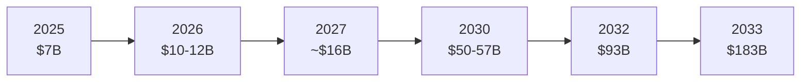

# Market Sizing

## 2026 Market Snapshot

| Metric | Figure | Source |
|--------|--------|--------|
| Standalone agentic AI market (2026) | **$10-12B** | Grand View Research / MarketsandMarkets / Mordor Intelligence |
| Purpose-built AI agent software spend (2026) | **$206.5B** | Gartner |
| Total global AI market (2026) | **$2.59T** | Gartner |
| CAGR (standalone agentic AI) | **44-50%** | Multiple firms |
| Projected standalone market (2030) | **$50-57B** | DemandSage / Mordor Intelligence |
| Projected standalone market (2033) | **$182.9B** | Grand View Research |
| Big Tech AI infrastructure investment (2026) | **$650-725B** | Industry estimates |

!!! note "Understanding the Two Numbers"
    The gap between $10-12B (standalone) and $206.5B (total agent software) reflects scope. The larger Gartner number includes embedded agent capabilities in existing enterprise software (Salesforce adding Agentforce, Microsoft adding Copilot, etc.). The standalone number captures purpose-built agentic platforms like Lyzr, LangGraph commercial offerings, and similar products.

---

## Growth Trajectory

### By Segment (Supply Chain Example)

Gartner specifically forecast supply chain management software with embedded agentic AI:

- **2025:** <$2B, 5% enterprise adoption
- **2030:** $53B, 60% enterprise adoption

This pattern (5% → 60% adoption in 5 years) will likely repeat across other enterprise functions.

---

## Enterprise Spending Patterns

| Deployment Model | Typical Annual Cost |
|-----------------|-------------------|
| Pre-built SaaS agents | $100-$1,000 per agent per month |
| Low-code agent platforms | $500-$5,000 per month subscription |
| Custom development (open-source) | "Free" license + $250K-$1M infrastructure annually |
| Enterprise Control Plane | Custom pricing + per-run usage |

### ROI Data

- **Average ROI on agentic AI:** 2.3x within 13 months (IDC, 2026)
- **Lyzr customers report:** up to 300% ROI within first year
- **Only 23%** of organizations report significant ROI from AI agents (Writer, 2026)
- **79%** report AI adoption challenges (Writer, 2026)

---

## What This Means for Competition

The market is large enough for multiple winners, but the dynamics favor platforms that:

1. **Close the production gap** -- the 89% failure rate is the central problem
2. **Offer consumption-based pricing** -- align cost with value delivered
3. **Provide governance** -- the #2 barrier after unclear business value
4. **Support multi-framework** -- no enterprise will run just one framework
5. **Deploy anywhere** -- cloud, VPC, on-prem, air-gapped
