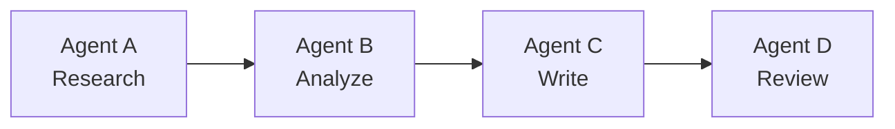
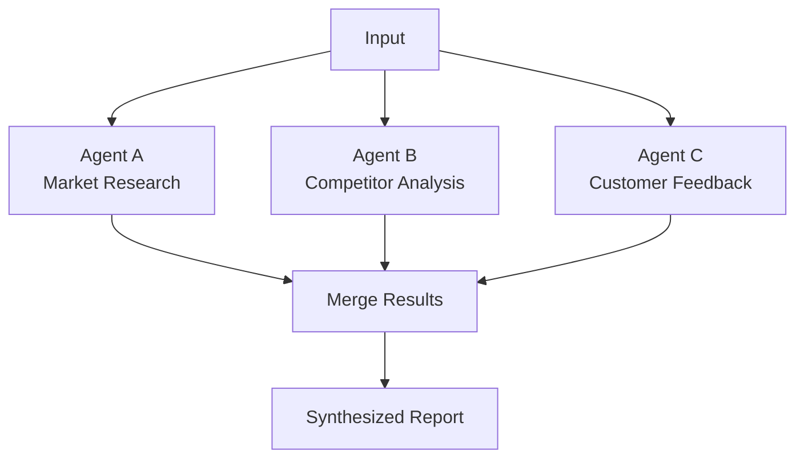
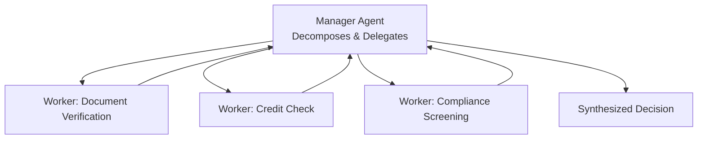
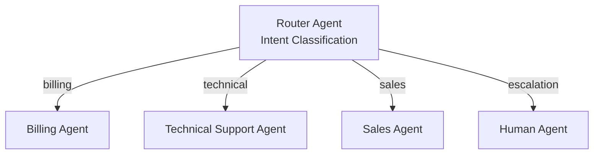
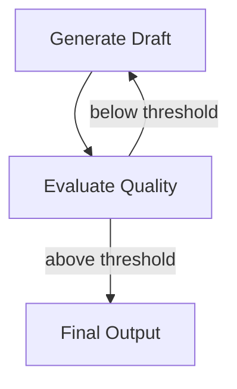
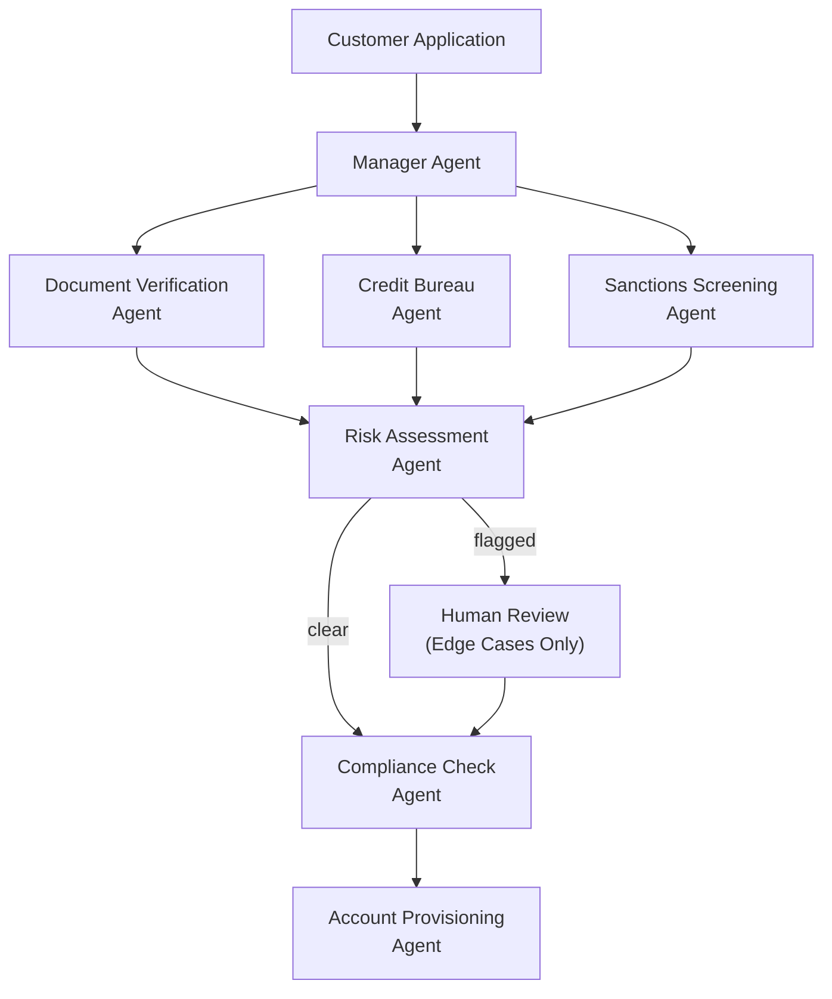
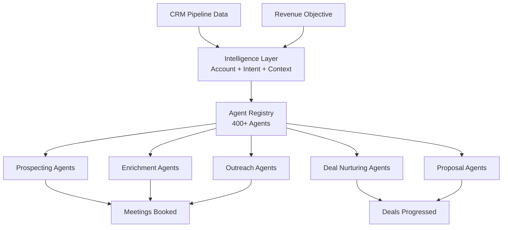

# Architecture Patterns

## Orchestration Patterns in Production

Lyzr supports five orchestration patterns that dominate enterprise deployments in 2026. Most production systems combine multiple patterns.

---

## Pattern 1: Sequential (Chain)

Agents execute in order. Each agent's output feeds the next agent's input.

**Best for:** Linear workflows with clear handoffs (e.g., research → draft → review → publish).

---

## Pattern 2: Parallel (Fan-Out / Fan-In)

Multiple agents execute simultaneously. Results are merged.

**Best for:** Independent subtasks that can run concurrently (e.g., multi-source research).

---

## Pattern 3: Hierarchical (Manager + Workers)

A manager agent decomposes goals and delegates to specialist workers.

**Best for:** Complex, goal-driven tasks where the execution path varies by input (e.g., KYC processing).

---

## Pattern 4: Handoff (Routing)

Route the user to the right team or agent based on intent.

**Best for:** Customer-facing systems with multiple specialized teams.

---

## Pattern 5: Loop (Iteration with Evaluation)

Repeat until quality threshold is met.

**Best for:** Quality-sensitive content generation, code review cycles.

---

## Hybrid Pattern (Production Standard)

Most enterprise deployments combine patterns:

1. **Handoff** at the top → route to the right team
2. **Hierarchical** within each team → manager delegates to specialists
3. **Sequential or parallel** within each specialist's workflow
4. **Loop** for quality-sensitive steps

---

## Vertical Reference Architectures

### Banking: KYC Processing (Amadeo)

**Results:** 5x faster onboarding, 60% compliance workload reduction, ~$1.02/run.

### Sales: SDR Workflow (Jazon)

### Telecom: Operations Monitoring

Parallel orchestration for telemetry processing across distributed assets:

- Multiple agents simultaneously analyze sensor data, weather feeds, and ticketing system events
- Aggregate into unified operational dashboard
- Flags exceptions for human review

### Government: Air-Gapped Deployment

Cross-framework orchestration in air-gapped environments:

- Agents from multiple frameworks operating under one identity, observability, and policy enforcement model
- Infrastructure never touches the public internet
- CISO-approvable and auditable

---

## SuperFlow Node Types (Production DAG Builder)

| Category | Nodes | Purpose |
|----------|-------|---------|
| **AI Nodes** | AI Agent, A2A Agent, LLM, AI Swarm, Tool | Execute intelligence |
| **Logic Nodes** | If, Switch, Loop, Filter, Merge, Stop/Error, Wait, NoOp | Control flow |
| **Integration** | HTTP Request, Code Block, Webhook Trigger | External systems |
| **Governance** | Wait for Approval | Human-in-the-loop |
| **Scheduling** | Cron Trigger | Recurring execution |
